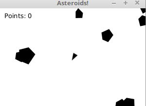

# Asteroids Game

## Project Overview

This is a classic Asteroids game implemented in Java using JavaFX. The game features a spaceship that the player can control to navigate through space, avoiding and shooting asteroids. The goal is to survive as long as possible and score points by destroying asteroids.

## Features

- **Smooth Controls**: Use the arrow keys to rotate and move the spaceship, and the space bar to shoot projectiles.
- **Dynamic Asteroids**: Randomly generated asteroids that move and rotate, creating an unpredictable environment.
- **Collision Detection**: Realistic collision detection between the spaceship, asteroids, and projectiles.
- **Scoring System**: Points are awarded for each asteroid destroyed.

## Code Highlights

### Main Application

The main application initializes the game window, handles user input, and updates the game state.

### Ship Class

Defines the spaceship controlled by the player.

### Asteroid Class

Defines the asteroids that the player must avoid or destroy.
